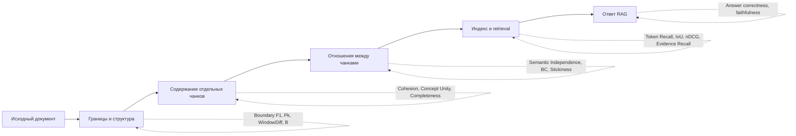
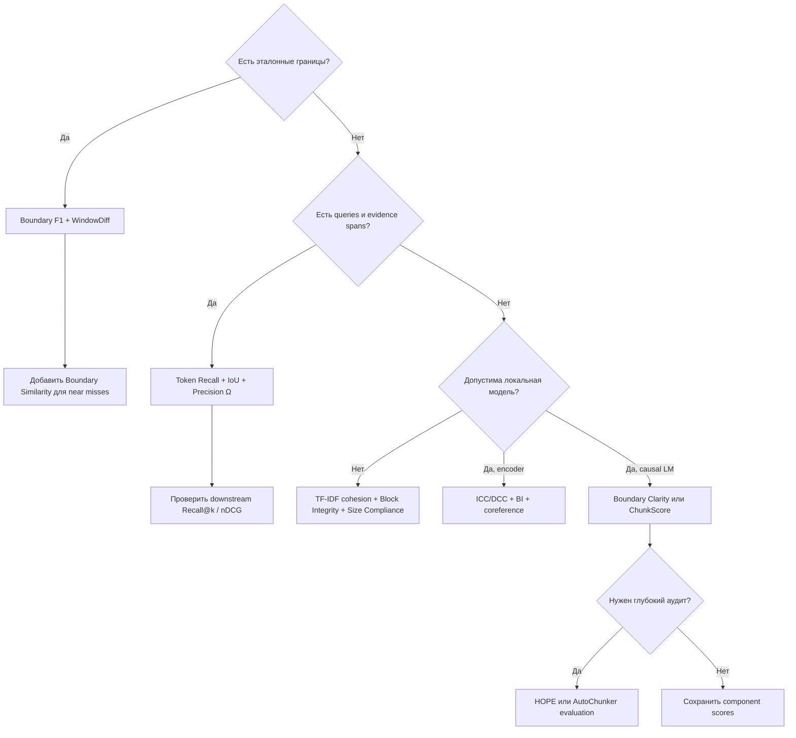

# Автоматические метрики качества чанкинга документов для RAG

## Резюме для руководителей

**Единственной общепринятой метрики качества чанкинга для RAG пока нет.** Существующие методы измеряют разные свойства: совпадение границ с эталоном, тематическую цельность, независимость чанков, сохранение исходной информации, структурную целостность документа либо фактическую эффективность retrieval. Поэтому практически надёжная оценка должна быть многокомпонентной. Классические метрики сегментации хорошо находят ошибки границ, но ничего не знают о запросах и retrieval; RAG-метрики отражают полезность чанков для поиска, но смешивают качество chunker, embedding-модели, retriever и набор запросов.

Наиболее рациональный стек оценки выглядит так:

1. **При наличии эталонных границ:** tolerant Boundary F1 плюс WindowDiff или Boundary Similarity. Это дешёвая и воспроизводимая оценка геометрии разбиения.
2. **Без эталонных границ:** локальная cohesion/separation-оценка на TF‑IDF или embeddings плюс проверки размера, структурных блоков и разрыва coreference-цепочек.
3. **При наличии запросов и evidence spans:** token-level Precision, Recall и IoU из подхода Chroma. Это один из наиболее прямых способов измерить, сколько нужной информации сохранилось и сколько лишнего текста retrieval вынужден принести из-за выбранных границ.
4. **Для сравнительного исследования или дорогого аудита:** HOPE, AutoChunker evaluation, Boundary Clarity/Chunk Stickiness или ChunkScore.

Из современных методов **HOPE** наиболее полно покрывает concept unity, semantic independence и information preservation, но требует многочисленных LLM-вызовов. **Boundary Clarity и Chunk Stickiness** из MoC, а также **ChunkScore** занимают промежуточную позицию: они используют perplexity и embeddings, но не требуют полноценной генерации вопросов и ответов. **Adaptive Chunking** предлагает особенно практичный набор недорогих intrinsic-метрик: Size Compliance, Intrachunk Cohesion, Contextual Coherence, Block Integrity и разрывы coreference-цепочек. citeturn16view1turn16view2turn20search0turn17view0

**BLEU и ROUGE не следует использовать как основные метрики чанкинга.** Они измеряют лексическое совпадение, а не расположение смысловых границ. Если чанки после разбиения снова конкатенировать, исходный текст часто восстановится почти дословно, даже если границы были выбраны катастрофически плохо. В эксперименте HOPE BLEU служил именно слабым baseline и почти не предсказывал downstream-качество RAG. citeturn16view1turn15search6

Главный практический вывод: **минимально жизнеспособная оценка production-chunker должна объединять intrinsic-показатель, проверку сохранения структуры и retrieval-показатель**. Один скаляр полезен для автоматического выбора конфигурации, но для диагностики необходимо хранить отдельные компоненты: boundary quality, cohesion, independence, preservation, redundancy и retrieval recall.

## Область оценки и допущения

Под чанкингом здесь понимается разбиение одного документа на последовательность или иерархию фрагментов, которые затем индексируются и извлекаются в RAG или близком retrieval-пайплайне. В классической text segmentation атомарной единицей обычно является предложение, строка или абзац; в RAG границы также могут задаваться токенами, Markdown-блоками, секциями, таблицами или комбинацией структурных элементов. SegEval прямо определяет text segmentation как размещение границ между атомарными единицами и реализует как традиционные, так и edit-distance-метрики. citeturn16view6

Для анализа сложности используются обозначения:

| Символ | Значение |
|---|---|
| \(n\) | число атомарных единиц, обычно предложений или абзацев |
| \(K\) | число чанков |
| \(B_g, B_p\) | число эталонных и предсказанных границ |
| \(d\) | размерность embedding |
| \(Q\) | число оценочных запросов |
| \(R\) | суммарное число токенов в retrieved chunks |
| \(s\) | число синтетических утверждений или вопросов на чанк |
| \(L_{\text{enc}}(T)\) | стоимость прохода embedding-модели по \(T\) токенам |
| \(L_{\text{LM}}(T)\) | стоимость прохода causal LM или LLM по \(T\) токенам |

Оценки времени далее являются **инженерными порядками величины**, а не результатами единого опубликованного benchmark. Предполагается документ на 1 000 токенов, примерно 40–70 предложений и 4–10 чанков; прогретый Python-процесс; современный ноутбучный CPU; для embeddings — небольшая локальная sentence-encoder-модель; для perplexity — causal LM порядка 1,5–7B на одной потребительской GPU; для удалённой LLM — задержка порядка 1–3 секунд на запрос с возможностью батчинга. На холодном старте, CPU-only inference или при последовательных API-вызовах время может быть на порядок выше.

Метрики естественно располагаются по слоям:



Метрики в левой части лучше локализуют ошибку chunker, но хуже предсказывают конечный RAG. Метрики справа ближе к пользовательской ценности, однако сильнее зависят от retriever, embeddings, top‑\(k\), генератора и состава запросов. Именно поэтому Chroma перешёл от обычных document-level IR-показателей к token-level учёту evidence, а HOPE и ChunkScore пытаются оценивать чанки непосредственно, не выполняя полный downstream-пайплайн. citeturn4view0turn16view1turn20search0

## Каталог метрик

**Классические reference-based метрики сегментации**

| Метрика | Определение, интуиция и выход | Входы и ресурсы | Сложность и оценка времени для 1k токенов | Сильные и слабые стороны; зависимость от домена |
|---|---|---|---|---|
| **Exact / tolerant Boundary Precision, Recall, F1** | Граница считается правильной, если её позиция совпадает с эталонной. В tolerant-варианте допускается отклонение до \(\delta\) атомарных единиц и выполняется взаимно-однозначное сопоставление. \(P=M/B_p\), \(R=M/B_g\), \(F_1=2PR/(P+R)\). Выход: \(0\ldots1\), выше лучше. | Эталонные и предсказанные позиции границ; модели не нужны. | Для отсортированных границ \(O(B_g+B_p)\) времени и \(O(B_g+B_p)\) памяти; обычно **менее 1 мс**. | Максимально интерпретируемая метрика, удобна для hierarchical levels. Exact F1 чрезмерно наказывает почти правильные границы; tolerant F1 зависит от выбранного \(\delta\). Низкая зависимость от языка, но высокая зависимость от annotation policy. HiCBench использует chunk-point F1 на нескольких иерархических уровнях. citeturn13view3turn16view5 |
| **\(P_k\)** | Окно длины \(k\) скользит по документу. Для каждой пары позиций \(i,i+k\) проверяется, одинаково ли reference и hypothesis решают, принадлежат ли позиции одному сегменту. \(P_k\) — доля несовпадений; ниже лучше. Обычно \(k\) равно половине средней длины эталонного сегмента. | Две бинарные последовательности границ; gold segmentation обязательна. | С prefix sums или segment IDs — \(O(n)\) времени и \(O(n)\) памяти, возможен streaming \(O(1)\); **менее 1–2 мс**. | Дёшев и исторически широко использовался. Известные недостатки: асимметричное наказание false negative/false positive, сильный штраф за near miss и чувствительность к распределению длины сегментов. citeturn19search1turn19search0turn16view7 |
| **WindowDiff** | В каждом окне сравнивается **число** reference- и predicted-границ. Ошибка начисляется, если числа различаются: \(\mathrm{WD}=\frac{1}{n-k}\sum_i[\lvert b_g(i,i+k)-b_p(i,i+k)\rvert>0]\). Ниже лучше. Weighted-вариант использует величину разницы. | Gold и predicted segmentation; параметр окна \(k\). | \(O(n)\) с prefix sums, \(O(n)\) или \(O(1)\) памяти; **менее 1–2 мс**. | Исправляет часть асимметрий \(P_k\), но результат всё ещё зависит от \(k\), краёв документа и средней длины сегмента. Не измеряет семантическую полезность границ для RAG. citeturn19search0turn16view7 |
| **Segmentation Similarity \(S\)** | Сегментация преобразуется в эталон операциями вставки, удаления и сдвига границ. Нормализованная стоимость преобразования превращается в similarity \(0\ldots1\); выше лучше. | Две сегментации и стоимости edit operations. | Типичная динамическая программа: \(O(B_gB_p)\) времени, \(O(B_gB_p)\) памяти; память можно сократить до \(O(\min(B_g,B_p))\). Для короткого документа обычно **1–10 мс**. | Даёт частичный credit за почти правильные границы и лучше отражает степень несогласия, чем exact F1. Результат зависит от настроек стоимости сдвига и операций. citeturn19search3turn19search7 |
| **Boundary Edit Distance и Boundary Similarity \(B\)** | BED сопоставляет границы через match, insertion, deletion и near-boundary transposition/shift. Boundary Similarity нормализует edit cost; BED-confusion matrix позволяет получить boundary precision, recall и F1 с учётом near misses. | Gold и predicted boundaries; настройки допустимого сдвига и его стоимости. | Обычно \(O(B_gB_p)\); **1–20 мс** для 1k токенов. | Наиболее диагностичная классическая семья: различает точное совпадение, близкую границу, пропуск и лишнюю границу. Всё ещё требует эталона и не различает семантически важные и малозначимые boundaries. Реализована в SegEval. citeturn19search2turn16view6 |

Классические метрики полезны, когда chunking моделируется как задача **восстановления заданной разметки**. Однако для RAG валидных разбиений может быть несколько: одна система может использовать короткие retrieval chunks, другая — иерархические parent/child fragments, и обе могут успешно отвечать на вопросы. Поэтому высокое совпадение с одной human segmentation не гарантирует оптимального retrieval.

**Современные intrinsic- и RAG-ориентированные метрики**

| Метрика или семейство | Определение и интуиция | Вход → выход | Сложность, ресурсы и runtime | Сильные стороны, ограничения и доменная зависимость |
|---|---|---|---|---|
| **Chroma token Precision, Recall, IoU и Precision\(_\Omega\)** | Пусть \(t_e\) — токены gold evidence, а \(t_r\) — токены retrieved chunks. \(\mathrm{Precision}=|t_e\cap t_r|/|t_r|\), \(\mathrm{Recall}=|t_e\cap t_r|/|t_e|\), \(\mathrm{IoU}=|t_e\cap t_r|/|t_e\cup t_r|\). Лишние и дублирующиеся retrieved tokens понижают эффективность. Precision\(_\Omega\) оценивает oracle-набор чанков, необходимый для покрытия evidence, и тем самым сильнее изолирует эффект самих границ. | Документы, chunks, запросы, evidence spans, retriever → значения \(0\ldots1\) по запросам и агрегаты. Evidence может быть human-labeled или синтетическим. | Индексация \(O(KL_{\text{enc}})\); на запрос — retrieval плюс \(O(R)\) token accounting. С готовыми evidence и индексом: **0,05–0,5 с**. С LLM-генерацией запросов/evidence: **3–30 с**. | Очень хорошо измеряет information preservation, retrieval recall и лишний контекст. Чувствительна к query distribution, top‑\(k\), embedding-модели и качеству synthetic questions. В отчёте Chroma стратегия chunking меняла recall до девяти процентных пунктов; авторы отдельно отмечают ограниченное разнообразие синтетических вопросов. citeturn2view0turn4view0turn4view1turn4view2 |
| **Adaptive Chunking intrinsic suite** | **SC:** доля чанков в целевом диапазоне токенов. **ICC:** сходство предложений с embedding всего чанка. **DCC:** сходство чанка с окружающим context window. **BI:** доля абзацев, списков, таблиц и иных structural blocks, не разрезанных границей. **RC:** доля coreference-связей entity–pronoun, не разорванных между чанками. | Документ, chunks, token bounds, структурная разметка, embeddings и опциональная coreference-модель → пять scores и агрегат. Gold QA не нужна. | SC/BI: \(O(n)\), **1–20 мс**. ICC/DCC: \(O(L_{\text{enc}}(T)+nd)\), **0,05–0,5 с**. RC: зависит от coreference model, ориентировочно **0,2–3 с**. | Практичный и хорошо диагностируемый набор. Покрывает cohesion, structure, size и локальную independence через coreference. DCC может вознаграждать тематическую непрерывность, но не обязательно самодостаточность; RC зависит от качества coreference resolver и языка. Официальная реализация опубликована вместе с работой Adaptive Chunking. citeturn17view0 |
| **MoC Boundary Clarity \(BC\)** | Для соседних чанков \(d,q\): \(\mathrm{BC}(q,d)=\mathrm{PPL}(q\mid d)/\mathrm{PPL}(q)\). Если предыдущий чанк сильно помогает предсказывать следующий, между ними остаётся зависимость и граница недостаточно ясна; отношение ближе к единице интерпретируется как более независимая граница. | Последовательность chunks и causal LM с token log-probabilities → score по каждой границе и среднее. Gold и генеративные API-вызовы не нужны. | После кэширования unconditional PPL — \(O(KL_{\text{LM}})\). Ориентировочно **0,3–3 с на GPU** или **2–20 с на CPU**. | Напрямую измеряет semantic/logical independence границы и применима без labeled data. Сильно зависит от языка, доменной калибровки и perplexity конкретной LM; отношения PPL могут иметь неудобный масштаб. citeturn16view2turn7view0 |
| **MoC Chunk Stickiness \(CS\)** | Для пар чанков строится dependency graph: связь сильна, если conditional PPL заметно ниже unconditional PPL. Затем считается structural entropy графа. Высокая связность/«липкость» означает, что смысл чанков трудно отделить; ниже обычно лучше. | Chunks, causal LM, threshold и схема графа → скаляр graph entropy и, при необходимости, dependency graph. | Полный граф: \(O(K^2L_{\text{LM}})\), память \(O(K^2)\). Локальный граф ширины \(w\): \(O(KwL_{\text{LM}})\). Для 4–10 чанков: **1–15 с на GPU**, локальный вариант обычно быстрее. | Учитывает не только соседние, но и дальние зависимости. Полезен для документов с cross-references. Стоимость квадратична; threshold и LM влияют на результат; graph entropy сложнее объяснить продуктовой команде. citeturn7view0turn16view2 |
| **ChunkScore** | Комбинирует **Logical Independence** и **Semantic Dispersion**. LI использует отношение conditional/unconditional perplexity на соседних чанках. SD строит центрированную Gram matrix embeddings и применяет нормализованный \(\log\det(G+\alpha I)\): разнообразные, нерезервные чанки дают больший объём в embedding-пространстве. \(\mathrm{ChunkScore}=\lambda LI+(1-\lambda)SD\). | Chunks, causal LM, embedding model, \(\lambda,\alpha\) → один score и две компоненты. | LM: \(O(KL_{\text{LM}})\); embeddings: \(O(L_{\text{enc}})\); Gram \(O(K^2d)\), log-det \(O(K^3)\). При \(K<10\) доминирует inference: **0,5–5 с GPU**, **5–30 с CPU**. | Не требует QA, human labels или генеративных LLM-диалогов. Покрывает independence и redundancy. SD потенциально может вознаграждать избыточную фрагментацию и не проверяет фактическое сохранение информации. Авторы получили лучшую корреляцию при \(\lambda=0{,}3\) и сообщили корреляции выше 0,85 на дополнительных наборах, но эти значения требуют независимой репликации. citeturn20search0turn20search2 |
| **HOPE** | \(\mathrm{HOPE}=(\zeta_{\text{concept}}+\zeta_{\text{semantic}}+\zeta_{\text{information}})/3\). **Concept Unity:** LLM генерирует утверждения из чанка, embeddings измеряют их взаимное сходство. **Semantic Independence:** вопросы к чанку отвечаются с ним одним и с дополнительными retrieved chunks; близкие ответы означают самодостаточность. **Information Preservation:** из исходного документа строятся multiple-choice проверки, которые решаются по retrieved chunks. | Исходный документ, chunks, LLM, embeddings и retriever → три scores \(0\ldots1\) и итоговый HOPE. Human labels не обязательны. | Concept Unity: \(O(Ks^2d)\) плюс LLM. Independence: примерно \(O(Ks)\) двойных QA-проверок. Preservation: \(O(m)\) генераций и решений тестов. Ориентир: **20–100 LLM-операций, 10–90 с** при батчинге; без батчинга дольше. | Наиболее полное прямое покрытие concept unity, semantic independence и preservation. Авторы обнаружили, что independence была наиболее полезной и связывалась с ростом factual correctness до 56,2%, тогда как concept unity имела небольшой эффект. Ограничения: высокая стоимость, synthetic-data bias, LLM-judge variance и слабая локализация причин ошибки в агрегированном score. citeturn16view1turn3view0turn3view1turn3view2turn3view3 |
| **AutoChunker evaluation framework** | Пять критериев: **Noise Reduction**, **Completeness**, **Context Coherence**, **Task Relevance** и **Retrieval Performance**. LLM классифицирует chunks как шумные, самодостаточные и связные; оценивает relevance к задаче; для retrieval генерируются запросы и применяется graded relevance, включая weighted Precision@K. | Документы, chunks, описанная задача, LLM, embedding/retrieval pipeline → пять процентов или scores. | Не менее \(O(K)\) LLM-оценок плюс генерация запросов и relevance judgments. При батчинге примерно **5–30 вызовов, 5–45 с** на короткий документ. | Очень широкий operational audit: замечает boilerplate, неполноту, context switches и task mismatch. Однако оценки prompt- и model-dependent; task relevance не доменно-нейтральна, а retrieval score смешивает chunker и retriever. citeturn18search0turn18search2turn12view0turn12view1 |
| **HiCBench / HiChunk evaluation suite** | Сочетает chunk-point F1 на уровнях L1/L2/all, evidence recall и downstream response metrics. Benchmark содержит иерархические структурные annotations и evidence-intensive QA, чтобы различия между chunkers не скрывались из-за слишком разреженных evidence. | Предсказанные hierarchical boundaries, gold hierarchy, QA и evidence → boundary F1, retrieval/evidence scores и response quality. | Boundary scores: **<1 мс**. Evidence retrieval: **0,05–0,5 с** после индексации. Полный QA/LLM evaluation: **2–20 с и более**. | Один из наиболее подходящих вариантов для hierarchical chunking. Хорошо отделяет структурное совпадение от retrieval. Требует дорогой разметки или конкретного benchmark; результаты переносятся на другие домены не автоматически. citeturn16view5turn13view3turn14search11 |

**Lexical overlap как baseline.** BLEU, ROUGE-L и n-gram overlap дешевы — \(O(T)\) времени и памяти — но не являются специализированными метриками чанкинга. Они могут обнаружить фактическое удаление или перестановку текста, однако почти слепы к неправильному положению границ. Их разумно использовать лишь как sanity check на то, что chunker не потерял символы или предложения, но не как показатель concept unity, independence или retrieval suitability. Эксперименты HOPE подтверждают слабую связь BLEU с качеством RAG. citeturn15search6turn16view1

## Сводное сравнение и выбор

| Метрика | Стоимость | Семантическая чувствительность | Нужна размеченная информация | Простота реализации | Пригодность для RAG |
|---|---:|---:|---|---:|---:|
| Boundary F1 | Низкая | Нет | Gold boundaries | Высокая | Средняя |
| \(P_k\) | Низкая | Нет | Gold boundaries | Высокая | Низкая–средняя |
| WindowDiff | Низкая | Нет | Gold boundaries | Высокая | Средняя |
| Boundary Similarity / BED | Низкая | Нет | Gold boundaries | Средняя | Средняя |
| BLEU / ROUGE baseline | Низкая | Очень низкая | Reference text | Высокая | Низкая |
| Adaptive SC / BI | Низкая | Низкая | Нет; нужна структура | Высокая | Средняя–высокая |
| Adaptive ICC / DCC | Низкая–средняя | Средняя–высокая | Нет | Высокая | Высокая |
| Adaptive coreference RC | Средняя | Средняя | Нет | Средняя | Высокая для связного текста |
| Chroma token IoU / Recall | Средняя; высокая при синтезе QA | Высокая | Queries и evidence spans | Средняя | Очень высокая |
| MoC Boundary Clarity | Средняя | Высокая | Нет | Средняя | Высокая |
| MoC Chunk Stickiness | Средняя–высокая | Высокая | Нет | Низкая–средняя | Высокая |
| ChunkScore | Средняя | Высокая | Нет | Средняя | Высокая |
| HOPE | Высокая | Очень высокая | Нет human labels | Низкая | Очень высокая |
| AutoChunker evaluation | Высокая | Очень высокая | Task description; human labels не обязательны | Низкая | Очень высокая |
| HiCBench suite | Низкая–высокая по компонентам | Высокая | Hierarchy, QA, evidence | Средняя | Очень высокая |

Оценки отражают свойства самих методов, а не качество конкретной реализации. Например, Chroma token IoU при готовых evidence spans очень дешёв, но становится дорогим, если вопросы и evidence нужно сначала синтезировать LLM. Аналогично Boundary F1 почти бесплатна во время вычисления, но создание качественной human segmentation может быть самым дорогим этапом проекта. citeturn4view0turn16view5turn18search0

Практическое дерево выбора:



Для большинства production-проектов рекомендуется не ранжировать chunkers одним итоговым числом с самого начала. Надёжнее сначала исключить конфигурации, нарушающие hard constraints — слишком длинные chunks, разрезанные таблицы, потерянные участки текста, чрезмерный overlap, — а затем строить Pareto frontier по retrieval recall, token precision и вычислительной стоимости. Adaptive Chunking следует аналогичной идее: несколько intrinsic-компонентов используются для выбора стратегии отдельно для каждого документа, а не для утверждения универсально лучшего splitter. citeturn17view0

## Лёгкие метрики и реализация

Ниже приведены три рекомендуемых варианта, не требующие генеративных LLM. Первые два стандартизованы и требуют gold boundaries. Третий — практический reference-free composite, основанный на идеях intrachunk cohesion, block integrity и size compliance; это **инженерный proxy, а не устоявшаяся академическая метрика**.

**Tolerant Boundary F1**

Эта метрика оптимальна для regression tests, benchmark и задач, где эксперт может отметить приемлемые границы. Для RAG разумный tolerance часто задаётся в предложениях, а не в символах: например, граница в пределах одного предложения от экспертной может считаться near match. Exact precision/recall чрезмерно суровы к подобным смещениям, что мотивировало развитие edit-distance-подходов. citeturn19search0turn19search2

Порядок реализации:

1. Разбить документ на устойчивые atomic units: предложения, Markdown-блоки или абзацы.
2. Представить каждую границу индексом атомарной единицы, после которой она находится.
3. Не включать обязательные начало и конец документа либо одинаково обработать их в обеих разметках.
4. Однозначно сопоставить predicted и gold boundaries в пределах \(\delta\).
5. Вычислить precision, recall и F1; дополнительно сохранить распределение расстояний matched boundaries.

```text
function tolerant_boundary_f1(gold, predicted, delta):
    gold = sort(unique(gold))
    predicted = sort(unique(predicted))

    i = 0
    j = 0
    matches = 0

    while i < len(gold) and j < len(predicted):
        if abs(gold[i] - predicted[j]) <= delta:
            matches += 1
            i += 1
            j += 1
        else if predicted[j] < gold[i] - delta:
            j += 1          # лишняя predicted-граница
        else:
            i += 1          # пропущенная gold-граница

    precision = matches / max(1, len(predicted))
    recall    = matches / max(1, len(gold))

    if precision + recall == 0:
        f1 = 0
    else:
        f1 = 2 * precision * recall / (precision + recall)

    return precision, recall, f1
```

Для иерархического chunking метрику следует вычислять отдельно по каждому уровню: section, subsection, paragraph group. Сведение всех границ в одну плоскую последовательность скрывает разницу между пропуском крупной секции и неточным разбиением локального абзаца; многоуровневую оценку применяет HiCBench. citeturn16view5turn13view3

**WindowDiff**

WindowDiff полезна как второй независимый сигнал: Boundary F1 спрашивает, совпали ли позиции границ, а WindowDiff — насколько сильно меняется локальное число сегментов. Она особенно хорошо выявляет систематическое over-segmentation и under-segmentation. Метрика была предложена как улучшение \(P_k\) и доступна в NLTK и SegEval. citeturn19search0turn16view7turn16view6

Порядок реализации:

1. Создать бинарные массивы длины \(n-1\): `1` означает границу после атомарной единицы.
2. Рассчитать среднюю длину gold-сегмента.
3. Выбрать \(k\approx\frac{1}{2}\) средней длины сегмента.
4. Построить prefix sums границ.
5. Для каждого окна сравнить число gold и predicted boundaries.
6. Отдельно сообщать обычный и weighted WindowDiff, если важна величина over/under-segmentation.

```text
function window_diff(gold_boundary_array, pred_boundary_array, k, weighted=false):
    n = len(gold_boundary_array)
    gold_prefix = prefix_sum(gold_boundary_array)
    pred_prefix = prefix_sum(pred_boundary_array)

    error = 0

    for left in 0 .. n-k:
        right = left + k

        gold_count = gold_prefix[right] - gold_prefix[left]
        pred_count = pred_prefix[right] - pred_prefix[left]

        if weighted:
            error += abs(gold_count - pred_count)
        else:
            error += indicator(gold_count != pred_count)

    return error / max(1, n-k+1)
```

WindowDiff нельзя интерпретировать вне контекста \(k\): два эксперимента с разными окнами напрямую несопоставимы. В отчётах следует публиковать \(k\), среднюю длину gold-сегмента и число границ, а также Boundary F1, чтобы отличать near misses от неверного количества сегментов.

**Lightweight Cohesion–Separation–Integrity score**

Для production-корпуса без gold boundaries можно применять следующий дешёвый composite:

\[
\mathrm{LCSI}
=
\left(
\mathrm{ICC}
\cdot
\mathrm{BSEP}
\cdot
\mathrm{BI}
\cdot
\mathrm{SC}
\right)^{1/4}.
\]

Здесь:

\[
\mathrm{ICC}
=
\frac{1}{n}
\sum_i
\cos(v_i,\bar v_{c(i)})
\]

— среднее сходство предложения с centroid своего чанка;

\[
\mathrm{BSEP}
=
\frac{1}{K-1}
\sum_j
\left[
1-\cos(\bar v_{\text{left},j},\bar v_{\text{right},j})
\right]
\]

— средний semantic/lexical contrast вокруг границ;

\[
\mathrm{BI}
=
1-
\frac{\text{число structural blocks, пересечённых границей}}
{\max(1,\text{число structural blocks})}
\]

— block integrity;

\[
\mathrm{SC}
=
\frac{\text{число chunks в допустимом диапазоне}}
K
\]

— size compliance.

ICC, BI и SC непосредственно соответствуют компонентам официальной реализации Adaptive Chunking; boundary separation добавлен здесь как дешёвый противовес cohesion, иначе система может получить высокий score, объединив почти весь документ в один чанк. citeturn17view0

Для полностью model-free варианта используются sparse TF‑IDF-векторы. Для русского и смешанного текста полезны character n-grams длины 3–5: они не требуют морфологического анализатора и устойчивее к формам слов. При допустимости маленькой локальной encoder-модели TF‑IDF можно заменить multilingual sentence embeddings, не меняя остальную формулу.

```text
function lcsi(document, chunks, min_tokens, max_tokens):
    units = split_into_sentences(document)
    blocks = detect_paragraphs_lists_tables(document)

    # Вариант без нейросети:
    vectors = tfidf_character_ngrams(units, ngram_range=(3, 5))

    chunk_centroids = []
    for chunk in chunks:
        ids = sentence_ids_inside(chunk)
        centroid = normalize(mean(vectors[ids]))
        chunk_centroids.append(centroid)

    cohesion_values = []
    for sentence_id in 0 .. len(units)-1:
        c = chunk_containing(sentence_id)
        cohesion_values.append(
            cosine(vectors[sentence_id], chunk_centroids[c])
        )
    ICC = mean(cohesion_values)

    separation_values = []
    for each boundary between chunk j and j+1:
        left_ids  = last_m_sentence_ids(chunk[j], m=2)
        right_ids = first_m_sentence_ids(chunk[j+1], m=2)

        left_vec  = normalize(mean(vectors[left_ids]))
        right_vec = normalize(mean(vectors[right_ids]))

        separation_values.append(1 - cosine(left_vec, right_vec))
    BSEP = mean_or_one(separation_values)

    cut_blocks = count_blocks_crossed_by_boundaries(blocks, chunks)
    BI = 1 - cut_blocks / max(1, len(blocks))

    valid_sizes = count(
        min_tokens <= token_count(chunk) <= max_tokens
        for chunk in chunks
    )
    SC = valid_sizes / max(1, len(chunks))

    eps = 1e-8
    LCSI = ((ICC+eps) * (BSEP+eps) * (BI+eps) * (SC+eps)) ** 0.25

    return {
        "LCSI": LCSI,
        "ICC": ICC,
        "BSEP": BSEP,
        "BI": BI,
        "SC": SC
    }
```

Геометрическое среднее выбрано намеренно: очень плохая структурная целостность или отсутствие boundary contrast не должны полностью компенсироваться высоким cohesion. Однако веса и нормализацию необходимо калибровать на небольшом наборе реальных queries; универсального порога LCSI не существует. При TF‑IDF ожидаемое время для 1 000 токенов — примерно **2–30 мс**, при локальных embeddings — **30–500 мс** в зависимости от модели и hardware.

Дополнительные дешёвые проверки, которые целесообразно выполнять всегда: доля потерянных или переставленных символов, distribution chunk sizes, overlap ratio, доля дублирующихся токенов, число пустых chunks, разрыв Markdown headings от содержимого, разрезанные таблицы и списки. Это не заменяет semantic evaluation, но ловит ingestion-дефекты до запуска дорогих тестов.

## Гибридные и LLM-метрики

Гибридные методы нужны, когда локальная геометрия границ недостаточна. Например, два чанка могут быть тематически однородны, но первый содержать определение исключения, без которого второй становится логически неверным. Cohesion будет высокой, а semantic independence — низкой. HOPE, AutoChunker, Boundary Clarity и ChunkScore пытаются обнаруживать именно такие случаи. citeturn16view1turn16view2turn20search0turn18search0

| Метод | Оценочный workload на документ в 1k токенов | Типичная задержка | Иллюстративная переменная стоимость | Когда применять |
|---|---:|---:|---:|---|
| Chroma с синтетическими query/evidence | 3–15 генераций и фильтраций | 3–30 с | 5k–40k token-equivalents | Создание evaluation set без human evidence |
| Boundary Clarity | 8–20 LM forward passes | 0,3–3 с GPU | API не нужен; локальный inference | Массовое сравнение boundaries без QA |
| Chunk Stickiness | 10–100 conditional PPL passes | 1–15 с GPU | API не нужен; зависит от графа | Документы с дальними зависимостями |
| ChunkScore | 8–20 PPL passes плюс embeddings | 0,5–5 с GPU | API не нужен | Автоматический выбор кандидата chunking |
| AutoChunker evaluation | 5–30 LLM judgments/generations | 5–45 с | 10k–80k token-equivalents | Аудит шума, полноты и task relevance |
| HOPE | 20–100 LLM operations плюс embeddings/retrieval | 10–90 с | 20k–150k token-equivalents | Исследование independence и preservation |

Денежную стоимость корректнее считать формулой:

\[
\mathrm{Cost}
=
\frac{
T_{\mathrm{in}}C_{\mathrm{in}}
+
T_{\mathrm{out}}C_{\mathrm{out}}
}{10^6},
\]

где \(C_{\mathrm{in}}\) и \(C_{\mathrm{out}}\) — тарифы выбранной модели за миллион токенов. Например, при условной blended-цене **$1 за миллион token-equivalents** workload HOPE в 20k–150k соответствует примерно **$0,02–0,15 на документ**; при blended-цене **$10** — примерно **$0,20–1,50**. Это иллюстрация, не тариф конкретного поставщика; реальная стоимость зависит от повторного включения document context, batching, caching и количества samples.

**Когда оправдан HOPE.** Метод особенно полезен для документов, где смысл зависит от исключений, ссылок, условий и соседних фрагментов: нормативных документов, технических инструкций, медицинских протоколов и договоров. В таких случаях semantic independence важнее простой topic cohesion. Статья HOPE показала существенно более сильную связь independence с RAG-показателями, чем concept unity, что ставит под сомнение распространённое правило «один чанк — ровно одна тема». citeturn16view1turn3view0

HOPE не следует запускать на каждом документе без sampling. Практичная схема — сначала отфильтровать плохие варианты дешёвыми метриками, затем применять HOPE к случайной стратифицированной выборке: короткие и длинные документы, разные языки, таблицы, high-coreference тексты и документы с большим числом перекрёстных ссылок.

**Когда лучше Boundary Clarity или ChunkScore.** Эти методы подходят, если доступна локальная causal LM, но нельзя отправлять документы во внешний API. Они не требуют генерации synthetic QA и дают более стабильную воспроизводимость при фиксированных weights и model version. Boundary Clarity проще и локальнее; ChunkScore дополнительно учитывает глобальную semantic dispersion. citeturn16view2turn20search0

Perplexity-метрики необходимо калибровать отдельно по языкам и жанрам. Высокая perplexity может отражать редкую терминологию, формулы, код или OCR-ошибки, а не плохую границу. Для русского корпуса causal LM должна уверенно моделировать русский язык; сравнивать абсолютные BC/LI scores, полученные разными моделями, некорректно.

**Когда оправдан AutoChunker evaluation.** Framework полезен при operational evaluation, когда chunker должен одновременно удалять boilerplate, сохранять самодостаточные units, соответствовать конкретной задаче и давать хорошие retrieval results. Его пять критериев шире HOPE, но task relevance делает результат менее domain-agnostic. citeturn18search0turn18search2

LLM-as-a-judge требует контроля воспроизводимости: фиксированной версии модели, temperature, prompts, числа повторов и порядка chunks. Для критичных сравнений полезно выполнять минимум 3 независимых judgments, сообщать mean и confidence interval, а также проверять часть результатов человеком. Иначе небольшая разница между chunkers может быть меньше variance самой LLM-оценки.

## Open-source, пробелы и исследовательская повестка

**Доступные инструменты**

| Проект | Что реализовано | Практический комментарий |
|---|---|---|
| **NLTK `nltk.metrics.segmentation`** | WindowDiff, \(P_k\), Generalized Hamming Distance | Самый простой вариант для классических baseline; функции принимают бинарные последовательности границ. Не следует путать с `nltk.chunk.ChunkScore`, который оценивает синтаксический shallow parsing, а не document chunking. citeturn16view7 |
| **SegEval** | Boundary Edit Distance, Boundary Similarity, BED confusion matrix, precision/recall/F1, Segmentation Similarity, WindowDiff, \(P_k\), inter-coder agreement | Наиболее полный специализированный пакет для reference-based text segmentation. Последний документированный release старый, поэтому перед production-use стоит проверить совместимость с современной Python-средой. citeturn16view6 |
| **Chroma `chunking_evaluation`** | Token-level evaluation pipeline, generation of domain-specific evaluation data, несколько chunkers | Подходит для сравнительных retrieval-экспериментов; официальный repository связан с техническим отчётом Chroma. citeturn16view4 |
| **Adaptive Chunking** | SC, ICC, DCC, BI, filtered missing-reference/coreference error; splitter selection | Особенно полезен как готовый intrinsic baseline. Репозиторий содержит modular metrics, PDF parsing и reproduction data; часть coreference-зависимостей имеет отдельные лицензионные условия. citeturn17view0 |
| **Meta-Chunking / MoC** | Boundary Clarity, Chunk Stickiness и MoC chunker | Исследовательская реализация perplexity- и graph-based evaluation; требует локальной LM и аккуратной настройки inference. citeturn14search2turn16view2 |
| **QChunker** | ChunkScore, chunking/retrieval pipeline и evaluation notebook | Реализация новой метрики Logical Independence + Semantic Dispersion; проект ориентирован на GPU и domain RAG. citeturn16view3turn17view2 |
| **HiChunk / HiCBench** | Hierarchical boundary metrics, evidence-oriented QA, retrieval и response evaluation | Наиболее релевантен для hierarchical chunking и evidence-dense benchmarks; repository содержит metrics и retrieval pipeline. citeturn16view5turn17view3 |

**Основные пробелы**

**Отсутствие универсальной reference-free метрики.** HOPE, BC/CS и ChunkScore — важные шаги, но пока нет независимо реплицированной метрики, которая стабильно предсказывает retrieval и generation quality для разных языков, retrievers, embeddings, chunk sizes и типов документов. HOPE тестировался на семи доменах, MoC и QChunker — на собственных наборах и конфигурациях; необходимы cross-benchmark studies, в которых метрика и downstream pipeline разрабатываются разными группами. citeturn16view1turn16view2turn20search0

**Неединственность правильной сегментации.** Документ может иметь несколько разумных разбиений, а human annotators могут не соглашаться о точном положении topic boundaries. Классические metrics сравнивают с одной или несколькими references, но не моделируют множество equally valid RAG granularities. Segmentation Similarity и Boundary Similarity смягчают near misses, однако не решают проблему query-dependent validity. citeturn19search3turn19search2

**Смешение качества chunker и retriever.** Recall@k, MRR, nDCG и даже token IoU зависят от embedding model, ANN index, reranker и top‑\(k\). С другой стороны, полностью intrinsic metrics могут пропустить query-specific failure. Перспективное направление — контрфактическая оценка: фиксировать evidence span и вычислять минимальную стоимость его покрытия при разных boundaries независимо от ranking model, развивая идею oracle Precision\(_\Omega\). citeturn4view0turn4view2

**Слабая оценка дальних зависимостей.** Локальный boundary contrast не замечает, что условие на первой странице модифицирует правило на десятой. Chunk Stickiness пытается построить глобальный dependency graph, а HOPE проверяет изменение ответов при добавлении других chunks, но оба подхода дороги. Нужны дешёвые dependency-aware metrics на entity graphs, discourse relations и explicit cross-references. citeturn7view0turn3view2

**Недостаточная поддержка структуры и мультимодальности.** Таблицы, подписи к рисункам, формулы, сноски и header hierarchy часто теряются ещё на parsing stage. Block Integrity из Adaptive Chunking и hierarchical annotations HiCBench покрывают часть проблемы, но большинство метрик всё ещё трактует документ как линейную последовательность текста. citeturn17view0turn16view5

**Семантическая redundancy и overlap.** Token precision штрафует дословно повторяющийся контекст, но плохо видит перефразированную дубликацию. Semantic Dispersion в ChunkScore направлена на low-redundancy representation, однако log-determinant может поощрять искусственное разнообразие или слишком мелкие chunks. Перспективна отдельная redundancy-метрика, объединяющая token multiplicity, embedding similarity и число retrieval slots, занятых эквивалентной информацией. citeturn20search0turn4view2

**Мультиязычность и русский язык.** Boundary metrics почти language-agnostic после качественной sentence segmentation, но embeddings, perplexity и coreference resolution могут вести себя неравномерно между языками. Нужны русскоязычные и multilingual benchmarks с boundary annotations, evidence-dense QA, нормативными текстами, техническими инструкциями и документами со сложной морфологией.

**Стоимость как часть качества.** Большинство работ оптимизирует correctness или recall, но production-решение должно учитывать число chunks, индексный объём, ingestion latency, retrieval latency, число retrieved tokens и LLM context cost. Перспективный итоговый объект — не один score, а Pareto surface:

\[
\left(
\text{evidence recall},
\text{token precision},
\text{semantic independence},
\text{index size},
\text{latency},
\text{monetary cost}
\right).
\]

**Рекомендуемый исследовательский baseline.** Для нового benchmark целесообразно публиковать tolerant Boundary F1, WindowDiff, Boundary Similarity, Adaptive ICC/BI/RC, Chroma token Precision/Recall/IoU, retrieval Recall@k и nDCG, а на репрезентативной подвыборке — HOPE или AutoChunker evaluation. Такая комбинация покрывает границы, concept cohesion, structural integrity, semantic independence, information preservation и реальную retrieval effectiveness, не делая весь эксперимент зависимым от одного дорогостоящего LLM-judge. citeturn16view6turn17view0turn2view0turn16view1turn18search0